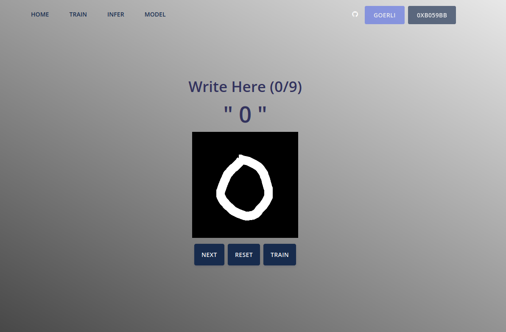

# Blockchained ML
Federated Learning on Blockchain exploiting zk-SNARK.



## App
http://tk2-252-35891.vs.sakura.ne.jp:5173/

## About
個々人がプライベートなデータで学習させたAIを、サーバーを介して共有して新たなAIを構成するFederated Learningという手法が脚光を浴びている。だが、この手法はサーバーによるAIモデルの改ざんや、ユーザーによるAIモデル攻撃のリスクを孕んでいる。この解決のため、我々はサーバーの役割をブロックチェーンで置き換えた、Blockchained MLを開発した。サーバー処理をスマートコントラクトで実装することで、AIモデルの更新プロセスに偽りが無いことが誰でも検証可能になる。更に、スマートコントラクト上でゼロ知識証明の検証を行うことで、AIモデルの更新という重い処理をアウトソース化すると同時に、AIモデルへの悪意ある操作を防ぐことができる。  
今回我々が作成したのは、他人と協力して手書き数字判別AIの学習を相互検証可能な形で行えるwebサービスだ。ユーザーは、ページ上に自ら描いた数字をAIに学習させ、判定精度を学習前と比較することで、AIの学習過程を体験できる。更に、学習したAIと対応するゼロ知識証明をブロックチェーンに反映させ、全世界のユーザーに学習を引き継いでいくことができる。

## How Zero-Knowledge Proof Works in Blockchained ML
FedAvgなどに代表されるようなFederated Learningのサーバー処理をスマートコントラクト上で行うことにはBlockchain特有の課題がある。それは、MLモデルの持つデータ量によるスマートコントラクトの実行コストである。スマートコントラクト上で実行するに耐えないモデル更新計算を実現するために、Blockchained MLではゼロ知識証明を用いた計算のアウトソース化を行った。  
更に、悪意のあるユーザーがMLモデルを汚してしまうというFLが持つ問題を解決するために、ユーザーが送信する勾配ベクトルのビット数を制限することでユーザーの提出する勾配ノルムに制限をする。
これは、後述するzk-SNARKプロトコルにおけるPublicデータの削減に繋がる。  
ゼロ知識証明の行う操作はおおよそ以下の疑似コードの通りである。
```
function(public new_hash, public old_hash, public gradients, private old_weights):
    if old_hash != hash(old_weights):
        return false

    return new_hash == hash(old_weights + gradients)
```
この関数に対応したzkProofをスマートコントラクト上で検証することで、正しい勾配ベクトルのハッシュ値のみをEVM上に乗せ、モデルデータを検証可能な形でブロックチェーン外のストレージに対比させることが可能になる。これはガス代の削減に寄与すると同時に、結果的に勾配ベクトルの制限を達成する。

## The Latest Mode Data Availability
上で説明したプロセスにより、スマートコントラクト上には検証された勾配ベクトルの履歴をEVMのログ領域からロードすることができる。これらの勾配ベクトルのすべての和を初期モデル(スマートコントラクトデプロイ時に決定する)に足すことにより、ユーザーは最新モデルを再構築可能になる。実用上は、誰かからモデルデータをもらい、スマートコントラクト上のハッシュ値と比較することで安くモデルの検証を完了することができる。

## Structures
- `/contracts`: Smart contract verifying zk-SNARK proofs and update the global ML model.
- `/src`: Web app sources and ML backends written in TensorFlow.js.
- `/zokrates`: zk-SNARK circuits written in Zokrates and the smart contract's proving key.

## How to build
```
$ npm install
$ npm run serve
```

## Deployed Contract
Ethereum Goerli Test Net (0xCfEb5C21Df7Ca884A703d0c70C80643c98166770)

## Resources and credits
Truffle Suite (https://trufflesuite.com/)  
Zokrates (https://github.com/Zokrates)  
TensorFlow.js (https://www.tensorflow.org/js)  
Argon - Design System (https://www.creative-tim.com/product/vue-argon-design-system)

## TODO
- zkSNARK内におけるPackedされたモデル配列加算のオーバーフローへの対処

## License
Apache License 2.0 (http://www.apache.org/licenses/LICENSE-2.0)
